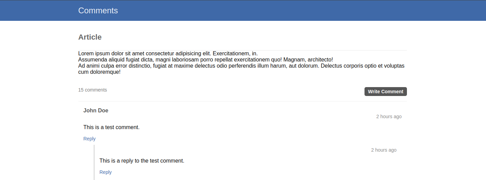

# Nested Comments Web Application

This repository contains a web application that allows users to leave nested comments on articles. The application is built using **PHP, MySQL, HTML, CSS, and JavaScript**.

## Table of Contents
- [Nested Comments Web Application](#nested-comments-web-application)
  - [Table of Contents](#table-of-contents)
  - [Introduction](#introduction)
  - [Features](#features)
  - [Pages](#pages)
  - [Technologies Used](#technologies-used)
  - [Installation](#installation)
  - [Usage](#usage)
  - [Screenshot](#screenshot)
  - [Contact](#contact)
  - [Credits](#credits)

## Introduction
The **Nested Comments Web Application** enables users to engage in threaded discussions by allowing nested replies to comments. This functionality enhances user interaction and provides an organized structure for discussions.

## Features
- **Nested Comments**: Users can leave comments on articles and reply to other comments, creating a threaded discussion.
- **Responsive Design**: The application is optimized for desktop and mobile devices.
- **MySQL Database**: All comments are stored persistently in a structured MySQL database.
- **Client-Server Interaction**: Uses server-side PHP scripts for managing data and client-side JavaScript for a dynamic user experience.
- **Simple and User-Friendly UI**: Designed for intuitive navigation and easy interaction.

## Pages
1. **Homepage**: Displays articles and their associated comments.
2. **Comment Section**: Allows users to submit comments and view nested discussions.

## Technologies Used
- **Frontend:** HTML, CSS, JavaScript
- **Backend:** PHP, MySQL
- **Database Management:** MySQL (`database.sql` for schema setup)
- **Client-Side Enhancements:** JavaScript for comment submission and threading

## Installation
1. Clone this repository to your local machine.
2. Set up a local development environment with PHP and MySQL.
3. Import the `database.sql` file to create the necessary database tables.
4. Modify the **comments.php** file to update database connection credentials (**ensure username and password are changed for security reasons**).
5. Start a PHP server and navigate to the project directory in your web browser.

## Usage
Once the application is running, users can:
- Read articles and view associated comments.
- Post new comments and reply to existing ones, creating nested discussions.

## Screenshot

## Contact
For inquiries regarding this project, please reach out via email:
📩 contact@xiaodev.fr

## Credits
The Nested Comments Web Application was created and maintained by **XiaoDev**.

---
If you have any questions or feedback, please [reach out](mailto:&#99;o&#110;&#116;%61%63t&#64;&#120;&#105;a&#111;&#100;%65%76%2e&#102;%72).